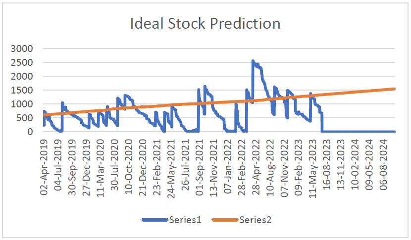

# Inventory-Prediction-Project

This project was compelted for the course Business Data Management for the [IIT Madras Diploma](https://study.iitm.ac.in/diploma/) in Data Science along with the company [Nasan Medical Electronics Pvt Ltd](https://nasanmedical.com/)

> Note: All the outputs and data for this project has been removed from this repository as per the companies request.

---

## Executive Summary

The primary objective of this project was to develop an intelligent solution to enhance inventory management for Nassan Medical Equipment. Machine Learning techniques were employed to achieve this goal. The project was divided into three key stages.
In the initial stage, data received from the company was subjected to comprehensive preprocessing. This phase yielded valuable reports, including dead-inventory and zero-inventory reports. These reports were instrumental in optimizing the existing inventory management system.
The second stage involved the utilization of the pre-processed data to train various regression algorithms. After rigorous statistical analysis, Lasso regression emerged as the most effective algorithm. The regression model was tuned and then applied to the sorted inventory items, providing valuable insights for the company.
The third and final stage focused on user-friendliness. A graphical user interface (GUI) was developed, integrating the ML model on the backend. This user-friendly interface empowered the company to use the ML algorithm more efficiently. It facilitated accurate predictions regarding the future usage of all inventory items.

## Outputs

## Award

This project was awarded the **Best Course Project for Business Data Management** Award by the IIT Madras.